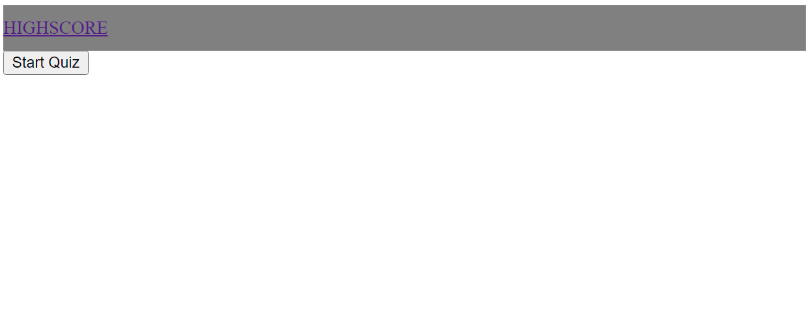
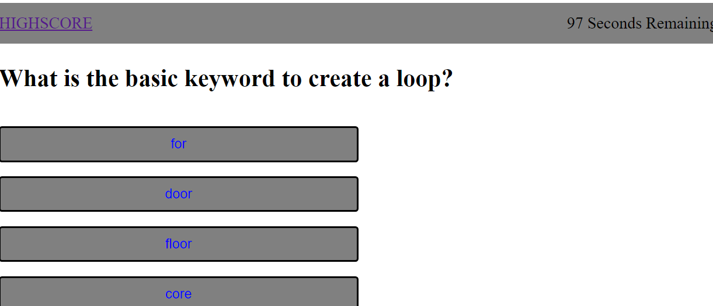
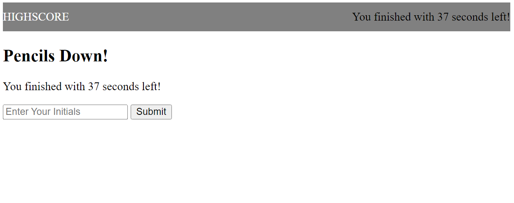
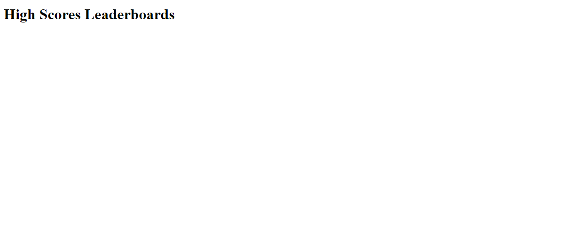

# Coding-Quiz

## Description

Welcome to the coding quiz. This was created using concepts of arrays, objects, loops, comparison statements, local storage, click events, and additional JavaScript topics.

## Usage

Please click "Start Quiz" in order to initialize the game. You will be prompted with 5 questions. A timer will start with 100 seconds remaining. If you select an incorrect answer, 10 seconds will decrease from your time. Once you have completed the quiz, your seconds remaining will count as your score. You can type in your initials to locally track your scores within the high score leaderboards.

### Quiz Splash Page

### Quiz Question Example

### End Game Screen

### High Score Board

## Credits
Ryan Ross: https://github.com/shayd3

Meg Meyers: https://github.com/femke77
